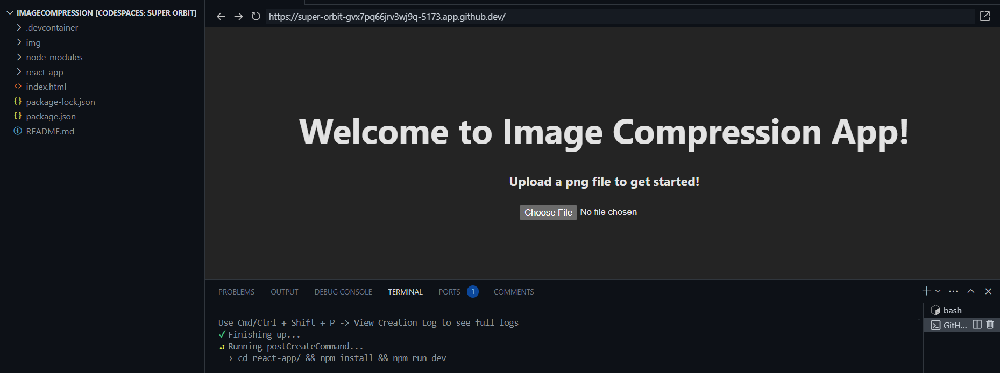
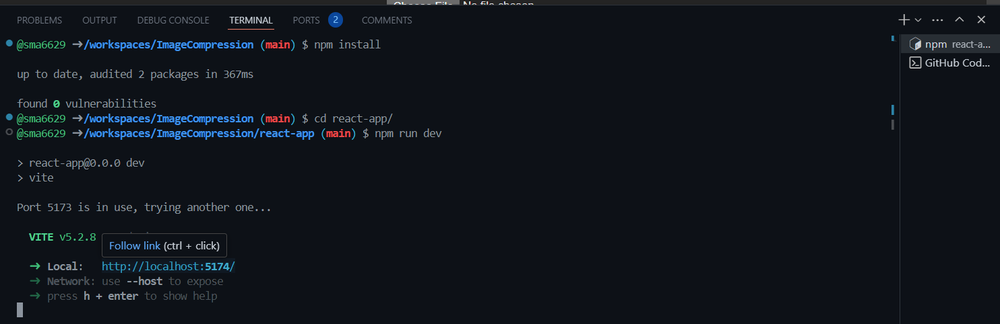

# Image Compression using Huffman Codes

Huffman coding is a widely-used technique for lossless data compression, particularly in image compression. It works by assigning variable-length codes to input characters, with shorter codes assigned to more frequent characters and longer codes assigned to less frequent characters. This ensures that the most common characters are represented by the shortest codes, resulting in efficient compression.

In the context of image compression, Huffman coding can be used to encode pixel values based on their frequency in the image. By replacing commonly occurring pixel values with shorter codes and infrequent pixel values with longer codes, Huffman coding helps reduce the overall size of the image file without losing any information.

## Launching this App on GitHub Codespaces

1. Click the `Code` button at the top of the repository.
2. Navigate to the `Codespaces` tab.
3. Click the `Create codespace on main` button to initiate the Codespace creation process.

5. Wait for the app to automatically build and run within the Codespace environment.

6. Once the app is built and running, you can view it in the preview window.
7. If the app does not automatically launch:
    - Open a `bash` terminal by clicking the `+` icon in the terminal pane.
    - Ensure that `node.js` is installed by running the command `npm install` in the terminal.
    - Navigate to the `react-app/` directory using the command `cd react-app/`.
    - Finally, start the app by running `npm run dev` in the terminal.
8. You can access the app by clicking on the provided link (usually `http://localhost:5174/`) to open it in a new browser tab.

## Using the Image Compression App
1. Click on *Choose File* button
2. Upload any *.png* image of your choice
3. Once uploaded, your image will be displayed along with its original file size
4. Click on *Save Compressed Data* button to save the compressed image as a *.bin* file to your computer

## Huffman Tree
A huffman tree can be generated by first counting the frequency of each value in the input data. In the context of image generation, this will be pixel values. The next step is to construct a priority queue with the values and their corresponding frequency. The huffman tree is then constructed iteratively. Two nodes with the lowest frequency are removed from the priority queue and joined together, creating a new node with the combined frequency. The new node with its two child nodes, is added back into the priority queue. This process keeps repeating until only the root node is left in the priority queue with a formed tree.

### Frequency Table

### Huffman Tree

### Encoding Table

